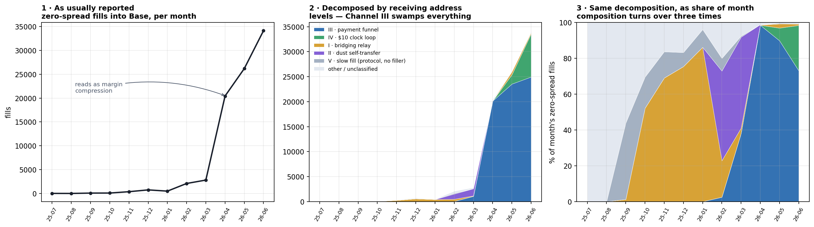

# Zero Spread Is Not One Thing

### Decomposing a cross-chain intent metric that looked like competition and wasn't

---

In a seven-day sample of Across V3 fills landing on Base, **41.5% of fills settled at exactly
zero gross spread** — 6,134 of 14,789. The filler paid out precisely what the user deposited,
keeping nothing *on-chain*, while still paying gas and an LP fee.

Widen the window and it looks like a trend with a story attached. Monthly zero-spread fills
into Base, July 2025 through June 2026:

```
2025-07        16
2025-08         8
2025-09        82
2025-10        92
2025-11       375
2025-12       754
2026-01       494
2026-02     2,097
2026-03     2,812
2026-04    20,435   ← 7× in one month
2026-05    26,187
2026-06    34,127
```

87,479 fills over twelve months, ending roughly 2,100× higher than it started. The obvious
reading writes itself: solver margins in cross-chain intent settlement are being competed to
zero, and the compression accelerated sharply in April 2026.

That reading is wrong, and the way it is wrong is the point of this article.

**"Zero spread" is not a behaviour. It is a shape that at least four unrelated businesses
happen to produce, plus one protocol artifact.** They start on different dates, run on
different chains, move amounts that differ by five orders of magnitude, and none of them is
a filler competing on price. The aggregate curve above is the sum of five things, and every
month-over-month statement anyone makes about it — including several I made — is a statement
about an accidental sum.

---

## 1. What the data is

Across is an intents-based cross-chain bridge. A user deposits on an origin chain and states
what they want to receive on a destination chain; independent agents called *fillers* (or
solvers) front the funds on the destination chain immediately, then reclaim them from the
protocol's liquidity pools a few hours later when a settlement bundle executes. The filler's
gross spread is the difference between what the user deposited and what the filler paid out.

Everything below uses fills landing on **Base**, read from Dune's decoded event tables.

- **Main sample**: destination Base, origin ∈ {Ethereum, Arbitrum}, output token ∈
  {USDC, WETH}, fast fills only, 2026-07-20 → 07-27. 14,789 fills, $6,256,939 notional,
  52.3% of all Base fills in that window.
- **12-month panel**: destination Base, all origins, all tokens, 2025-07 → 2026-07.

Two facts about the sample are worth stating because they determine how much weight the rest
can carry. Deposit-to-fill pairing is **100%** — 14,789 of 14,789, unique deposit IDs, no join
fan-out. And every one of the 14,789 fills has a token transfer of exactly the matching amount
inside the same transaction, with **zero** missing transfers and **zero** amount mismatches;
98.04% of those tokens verifiably leave the filler's own address. The measurement layer is
clean. Everything that goes wrong from here goes wrong at the interpretation layer.

---

## 2. The first thing that fails: splitting by filler

The natural first cut is by filler address. If zero-spread pricing is a strategy, it should
belong to particular firms.

It half-works, and the half that works is misleading. On the Ethereum→Base route in the main
sample, **3,541 of 3,609 zero-spread fills — 98.1% — belong to a single address**
(`0x07ae8551…`; the other 68 are slow fills, which have no filler at all). Meanwhile two large
fillers on the same route in the same week posted **1,579** and **1,817** fills with **zero**
zero-spread fills between them. On the Polygon→Base route, **925 of 925** zero-spread fills
belong to that same single address.

So zero-spread pricing is not a market-wide posture. It is highly concentrated. Case closed —
except that when you extend the same cut across twelve months, the filler→behaviour mapping
comes apart:

| Month | `0x07ae8551…` zero fills | Its top recipient | Median USDC | depositor = recipient |
|---|---|---|---|---|
| 2026-02 | 1,275 | `0x9a8f92a8…` | **$0.10** | **85.0%** |
| 2026-03 | 2,369 | `0x9a8f92a8…` | **$0.10** | 52.3% |
| **2026-04** | **20,229** | **`0x133243d4…`** | **$10.64** | **0.2%** |
| 2026-05 | 23,549 | `0x133243d4…` | $10.84 | 0.0% |

Between March and April the same filler switches from one activity to a completely different
one: from ten-cent transfers where the payer and the payee are the same address, to
ten-dollar transfers from **9,788 distinct payers** to a single destination. Same address,
same "zero spread" label, different business.

The reverse happens too. Filler `0x394311a6…` feeds a large-value flow (median $3,098) through
May 2026, then in June its zero-spread volume is 1,858 fills of which **1,835 are exactly
$10.00**, going to a recipient it had barely touched before.

**Fillers and channels are many-to-many.** A given channel is served by four to six fillers in
a typical month with the largest taking only 33%–70%; a given filler serves different channels
in different months. No single-dimension cut separates them.

---

## 3. The decomposition

What does separate them is running the cut on **four dimensions independently** and requiring
a channel to be stable on all four at once: recipient concentration, origin-chain composition,
the depositor-equals-recipient rate, and the amount distribution.

| | Channel | Active | Fingerprint | What it actually is |
|---|---|---|---|---|
| **I** | Bridging relay *(two of three addresses)* | 2025-10 → 2026-07 | origin = Arbitrum **100.0%** every month; USDC median $2.93 → $17,182; single token; depositor ≠ recipient 100%; receiving address rotated three times | A bridging product: user deposits on Arbitrum → filler pays an intermediary on Base → intermediary forwards to the user. **Measured for the 2nd and 3rd addresses. The 1st — which carries most of the volume — behaves differently and is not characterised.** See §4. |
| **II** | Dust self-transfer | 2026-02 → 2026-07 | USDC median **$0.10**; depositor = recipient **100%**; low volume throughout | Someone moving dust to themselves. Purpose untested. |
| **III** | Payment funnel | 2026-02, ramps 2026-04 | USDC median ~$10.6; **thousands** of distinct payers per month; depositor = recipient **0%**; four origin chains | Cross-chain checkout settlement. The vault forwards 99.5% onward to Base's official `commerce-payments` `ERC3009PaymentCollector`. |
| **IV** | $10 clock loop | 2026-05 → | **exactly $10.00**; origin = Arbitrum only; depositor = recipient 49%–96%; fires on round time boundaries | Automated loop. Purpose untested. |
| — | Slow fills | throughout | `relayer = 0x0`; 16–154 per month | Protocol mechanism, not a filler at all. |



*Left: the metric as usually reported. Middle: the same months attributed to a receiving
address. Right: the same attribution as a share of each month — which is where the "single
phenomenon" reading visibly breaks. Attribution is exhaustive: all 87,479 fills are assigned,
and the twelve monthly totals reproduce those produced independently by a query that groups by
filler instead. The pale band is genuinely unclassified — small recipients that never form a
persistent channel. Reproduce with* `figures/make_figures.py`.

The right panel is the argument in one image. The composition turns over three times in
twelve months: Channel I dominates late 2025, Channel II takes over in February 2026, Channel
III swamps everything from April, and Channel IV appears in June. At no point is the mixture
stable, and no two adjacent segments of that curve are measuring the same thing.

The April 2026 spike is Channel III and essentially nothing else — **20,133 of 20,435 fills,
98.5% of the month**. Channel III's monthly fill count runs 52 → 1,071 → **20,133** → 23,538 →
24,954, with distinct payers going 20 → 772 → **9,783**. That is one product scaling. It has
nothing to do with fillers competing, and the other channels barely move across the same
boundary.

Two caveats have to travel with this table rather than sit in a footnote, because without
them the table over-claims.

**Zero on-chain spread does not mean the operator earns nothing.** Everything measurable here
is the on-chain leg. Whatever these businesses actually charge — a front-end fee, an FX
spread, a subscription, an off-chain arrangement with the filler — happens somewhere this
data cannot see, and its scale is unknown. It could be larger than anything on this page.

**Channel I in particular has a broken economic story.** Its fee point has not been located.
Of three candidates — a front-end fee on notional, an exchange-rate spread, an off-chain
arrangement with the filler — only the first is visible in this data, and it is **excluded**
for two of the three relay addresses, which are lossless to the cent. The other two remain
untestable here. And the first address, carrying most of the volume, does not behave like the
other two at all. Channel I should not be listed alongside the others as if it were equally
understood, and this paragraph is the reason.

---

## 4. The second thing that fails: the self-transfer test

The cleanest-looking fingerprint in the table above is `depositor = recipient`. If someone is
moving money to themselves, they have no reason to pay a spread, which neatly explains zero
spread without any competition story. It is cheap to compute and it separates Channel II
(100%) and Channel IV (49%–96%) from Channel III (0%).

**On Channel I it gives exactly the wrong answer.**

Channel I shows `depositor ≠ recipient` in **100%** of fills, every month, for nine months.
On-chain, that is unambiguous: these are payments to a third party. Economically, they are
self-transfers — the user is moving their own money from Arbitrum to Base, and there is an
intermediary contract in between.

Establishing that required leaving the fill table and tracing ERC-20 flows through the
intermediary. For the third receiving address in July 2026: 47 inbound transfers totalling
$257,566, all from a single source; 45 outbound transfers totalling ≈$257,560 to 25 addresses,
**nearly every one of which appears as a payer in the fill set**. The WETH leg is the cleanest
version — 6 transfers in totalling 7.71 WETH, forwarded in full to one address, and that
address is itself one of the service's payers. Money in, money out, same people, same amounts.

That the three receiving addresses are successive versions of one service rather than three
unrelated ones is supported separately: of 260 payers, **37 paid two or more of them and 2 paid
all three**, and the pattern is sequential rather than concurrent, matching the rotation dates.

Two limits on that, stated plainly because they matter:

- This proves *the same users kept using the service after the receiving address changed*. It
  does **not** prove the three addresses share a controller. That would need a funding
  relationship, and none was found.
- The flow tracing initially covered **2026-07 only**, when the second address held $7,818 of
  residual volume and the **first address had never been traced at all**. "Channel I was always
  a relay" was, at that point, an extrapolation rather than a measurement.

### The extrapolation was then tested, and it failed

Extending the trace to all three addresses across their whole active span — about ten months
instead of one — splits them cleanly, and not the way the extrapolation assumed.

| Address | ERC-20 out ÷ in | Outbound landing on its own Across payers |
|---|---|---|
| **B** `0xbcbb05dd…` | **1.00×**, every month, to the cent | 32.5% – 97.2% |
| **C** `0x50554959…` | **1.00×** | 96.3% |
| **A** `0x0000…60f6e8` | **≈1.98×**, every month, for seven months | **9.1% – 36.9%** |

B and C are lossless pass-throughs: in December, May, July, whichever month you pick, the USDC
and WETH leaving equals what arrived, to the cent. That is what a relay looks like.

**A is not that.** It pays out about twice what it takes in, month after month; most of its
outflow does not reach its own Across payers; and its inbound side is thousands of transfers
from six to thirteen counterparties across eight to nineteen tokens, against two tokens going
out. B and C move dozens of transfers among a handful of counterparties.

I am not going to say what A is. The two-to-one imbalance is unexplained and there may be a
mundane reason I have not found. What can be said is narrower and more useful: **the relay
reading is a measurement for B and C and is not established for A — and A carries the majority
of the channel's lifetime volume.** The caveat two paragraphs up was not decorative. It was
load-bearing, and the load broke it.

This also settles one of the three fee-point candidates. Because B and C are lossless to the
cent, **a front-end fee taken at the relay is excluded** for them. The other two candidates —
an FX spread, or an off-chain arrangement with the filler — remain exactly as unmeasurable as
before. One of three, by exclusion, on two of three addresses.

The general lesson is the one that cost the most to learn here: **a fingerprint that is
correct on-chain can be wrong economically, and it will not announce that it is wrong.** The
same test is *valid* on Channel III — the vault there sends **0%** back to its payers, which
was measured, not assumed — and invalid on Channel I. Whether a discriminator discriminates
has to be established per channel, before it is used, not asserted from its plausibility.

---

## 5. What this does to the aggregate number

Concretely: **any statement about a monthly zero-spread rate has to name which channel it is
about, or it is a statement about an accidental sum.**

The claims that do not survive the decomposition:

| Retracted | Replaced by |
|---|---|
| "Zero spread is a route-differentiated phenomenon" | It is two mechanisms each leaving its own route footprint |
| "From February 2026 a previously non-existent phenomenon appears on Base" | The funnel was already formed in March; April is a ~19× amplification, and the correct start is April, not February |
| "99.8% flows to a single recipient, so the monthly curve is essentially pure" | That ratio came from one 7-day window and was extrapolated across twelve months |
| "Zero-spread behaviour is spreading — two other firms are copying it" | Those two are the $10 clock loop, an unrelated channel |
| "The vault is served exclusively by one filler" | Three fillers served it in July 2026. The *proportion* stands — 99.902% of Across-side value — but exclusivity does not |

There was very nearly a fifth retraction here, and the way it did not happen is worth the
space.

The largest single counterparty feeding the Channel III vault — 51.1% of its inflow in the
July window — is a **contract**, deployed on Base at **2026-04-20 18:14:27 UTC**, 36,198 bytes
of code. Its deployer address is the same address that receives Channel II's dust. On its
face that is a direct on-chain link between two channels this article calls unrelated, and it
would have been an easy and interesting thing to report.

Before reporting it I wrote down what would make it real: *if this address deployed a handful
of contracts and they sit inside the cluster, the link is strong; if it deployed thousands, it
is a deployment factory and the link is worth nothing.* Then I ran it.

**173 contracts, deployed between August 2023 and August 2026, still active.** Only one of
them is in the cluster. It did not deploy the vault, the filler that serves the vault, any of
Channel I's three relay addresses, or Channel IV's recipient. And the second contract it ever
deployed is `0x09aea4b2…` — **the Across SpokePool on Base itself**, the contract every fill
in this article is decoded from.

So the address is general-purpose deployment infrastructure, not an operator, and "these two
channels share a deployer" says roughly as much as "these two channels are both on Base."
**The link is dead.** Channel II's involvement is that a deployer address is receiving dust at
itself across chains — which is what deployer addresses do, not a business.

Two things survive from the exercise. First, the deployment date still does real work:
because that counterparty did not exist before 20 April 2026, the 48/51 inflow split **cannot**
describe February, March, or the first three weeks of April. In those months Across's share of
the vault's inflow was necessarily higher — by how much is unmeasured. A caveat previously
stated as "untested" turned out to be partly determinable at zero cost.

Second, and more to the point of this article: the discriminator was written down *before*
the query ran, with both outcomes and their consequences spelled out. Had it been written
afterwards, 173 would have been easy to read as "a modest number, mostly unrelated, so the
link stands." It is not obviously a factory. It only becomes one once you have committed in
advance to what a factory would look like.

An independent hint that the channels differ mechanically: zero-spread fills cost
**9.644 × 10⁻⁷ ETH** of gas each, against **2.965 × 10⁻⁶ ETH** for fills generally — about
3.1× cheaper, consistent with this flow being dominated by plain transfers rather than
contract-routed swaps. That is one month (2026-05, 141,183 transactions, zero unmatched), and
it is a consistency check, not a proof.

---

## 6. Method, and what would break it

**Single data source.** Every number here comes from Dune's decoded tables. Reconciliation in
this project is Dune-against-Dune: no block explorer, no independent RPC node, no protocol API
was used as a cross-check. **All conclusions in this article are therefore limited to what
Dune's decoders show.** A systematic decoding error — a mis-decoded field, a missing
generation of events — would not have been caught by anything done here. This is the largest
single caveat and it applies to every number above.

Within that limit, the checks that were run:

- **Pairing**: 14,789 / 14,789 deposits matched to fills; deposit-side window opened two days
  earlier than the fill side, without which spurious boundary non-matches appear.
- **Value reconciliation**: every fill has an exact-amount token transfer in the same
  transaction; zero missing, zero mismatched.
- **Attribution exactness**: for Channel III's vault, per-filler ERC-20 transfer counts equal
  per-filler fill counts exactly — 18,798 : 18,798, 1 : 1, 3 : 3. Attribution in that window is
  exact rather than approximate.
- **Independent recomputation**: the 2026-05 zero-spread count is **26,187** from two
  separately written queries with different grouping and different purpose.
- **Counterparty hygiene**: the Channel III vault appears to have 71 inbound counterparties.
  **62 of them are address poisoning** — $0 transfers from vanity addresses matching the first
  and last four hex characters of a real counterparty (2 bytes at each end, ~4.3 × 10⁹
  enumerations, GPU-minutes). After dropping zero-value rows there are **9** real sources and
  the top two are 99.45%. Any concentration statistic computed from raw ERC-20 counterparty
  counts is inflated — here by 7.9×.

  The mechanism is legible in the raw rows. The real filler is
  `0x07ae8551be970cb1cca11dd7a11f47ae82e70e67`; sitting beside it with a $0 transfer is
  `0x07ae4b0964d77f5f972b94f795854e94455f0e67` — `07ae` at the front, `0e67` at the back,
  nothing in between. The same treatment was applied to the payment collector contract
  `0x0E3dF951…7757`, which has two separate $0 impersonators in the same window. Poisoning is
  also weak evidence *for* significance, in a backwards way: attackers only bother to
  impersonate addresses that look important in a victim's transaction history, and the most
  heavily impersonated addresses here are the ones the analysis had independently identified
  as the main counterparties. That is a shape, not a proof, and it is not used as one.

Three scope limits that constrain the strongest claims:

1. Channel III's inflow decomposition is **not a stable ratio**. Across's share of the vault's
   USDC inflow reads **44.0%** in May 2026, **73.2%** in June, and **48.4%** in the partial
   July window. It moves by thirty points month to month. Any single figure — including the
   48% that this analysis reported first — describes one month and nothing more.
   February, March and most of April are separately *bounded*: the large non-Across
   counterparty was not deployed until 20 April, so its share is zero there by construction.
   And all three percentages are **upper bounds** on Across's share of total inflow value: they
   are computed on USDC alone, while the non-Across side brings in fourteen to twenty-five
   different tokens whose value is excluded.
2. Payer counts are not user counts. If each checkout derives a fresh address, 9,783 payers
   systematically overstates users. Untested, in either direction.
3. **Amounts here may be read as lower bounds; counts may not.** Counts are subject to at least
   two biases running in opposite directions and the net sign is unknown.

---

## 7. What I think the actual finding is

Not "margins compressed." The finding is that **on an intents protocol, the observable
economics of a fill and the economics of the business behind it can be completely
disconnected**, and the disconnect is invisible at the aggregate level.

Four unrelated products — a bridging relay, a dust loop, a checkout settlement rail, and an
automated $10 cycle — all emit the same on-chain signature, and it is a signature that reads
as competitive pricing. Anyone building a margin index, a solver-competitiveness dashboard, or
a filler P&L model from this field, without decomposing first, would produce a number that
moves for reasons that have nothing to do with what it is named after. I built exactly that
number before I decomposed it, which is how I know what it looks like from the inside: it was
plausible, it trended, and it was meaningless.

The open questions I could not close, in order of how much they would change the picture:

1. **What Channel I's first receiving address is doing.** It pays out about twice what it
   takes in, every month for seven months, and most of that outflow does not reach its own
   payers. It is not the relay the other two addresses are, and it carries most of the
   channel's volume. This is the largest hole in the analysis and it opened *after* the
   obvious question was finally asked.
2. **What the non-Across sources funding the Channel III vault are.** No public label, no
   independent data source available here, and the leading one changes between months —
   May's largest is a different address from June's.
3. **Why Across's share of that vault swings between 44% and 73%** across three consecutive
   months. Either the operator's routing changed or its non-Across volume is lumpy; nothing
   here distinguishes those.
4. **Where Channel I charges.** One of three candidates is excluded — the relay is lossless
   for two of its three addresses — and the remaining two, an FX spread and an off-chain
   arrangement with the filler, are not visible in any on-chain data. This may simply not be
   answerable from a block explorer, which is itself worth saying out loud.

---

*Queries, SQL, and a number-by-number provenance table are in [PROVENANCE.md](./PROVENANCE.md).
Every figure in this article can be re-derived at zero cost from a saved query ID.*
